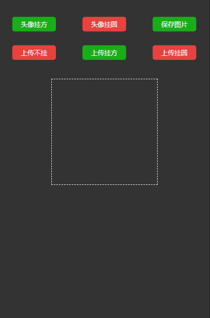
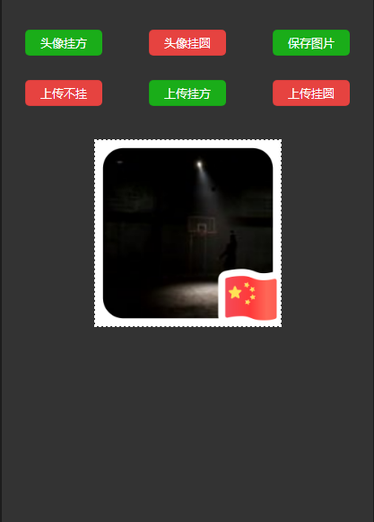
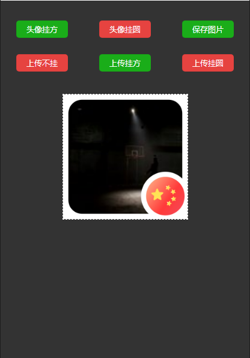

## 微信小程序，头像挂红旗
```markdown
# 微信头像挂红旗
1.通过设置按钮的open-type为"getUserInfo"来获取用户的头像信息。
2.在wxml页面放一个隐藏起来的canvas,用于绘制图片。
3.通过wx.canvasToTempFilePath将内容绘制到画布上。
4.通过wx.chooseImage实现图片上传，再进行绘制。
5.通过wx.saveImageToPhotosAlbum实现绘制图片的保存。
```
<div style="display:flex;justify-content:space-around;">
  
  
  
</div>

