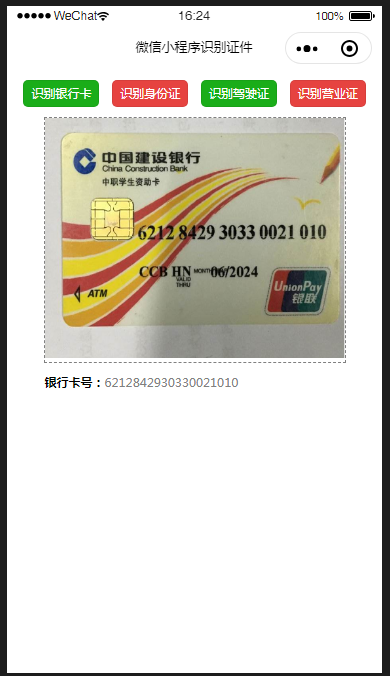
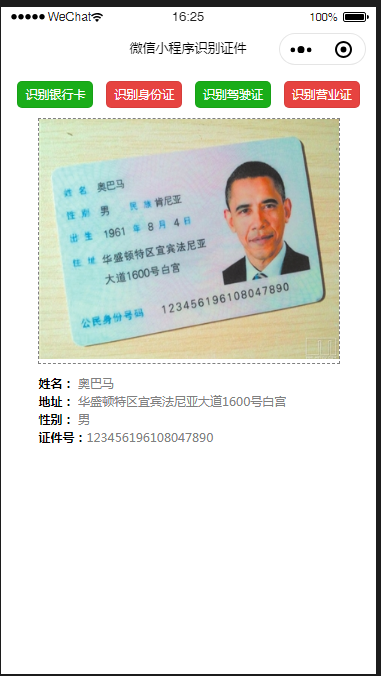
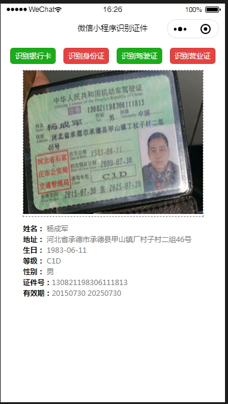
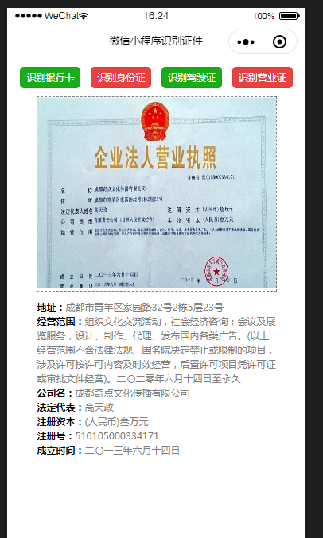

## 微信小程序，云开发识别图片
**云开发识别图片**
```markdown
1.要使用云开发首先要有自己的AppId，必须自己注册一个小程序。
2.新建项目的时候，为了避免麻烦后端服务勾选不使用云服务。
3.在project.config.json里添加配置，"cloudfunctionRoot":"cloud",cloud是函数存储的目录可以自行更改。在app.js里初始化云开发，环境ID在云开发的设置里可以找到。
 wx.cloud.init({
      env: "环境ID"
    })
4.各种识别图片接口的调用可以在服务端的OCR下方寻找，
https://developers.weixin.qq.com/miniprogram/dev/api-backend/open-api/ocr/ocr.bankcard.html

5.首先通过wx.chooseImage选择图片；
然后将选择的图片通过wx.cloud.uploadFile上传到云存储中；
然后使用wx.cloud.getTempFileURL，用云文件 ID 换取真实链接；
最后通过wx.cloud.callFunction识别图片信息，该函数下的name就是所对应云函数的名字。

```
<div style="display:flex;justify-content:space-around;">
  
  
  
  
</div>
